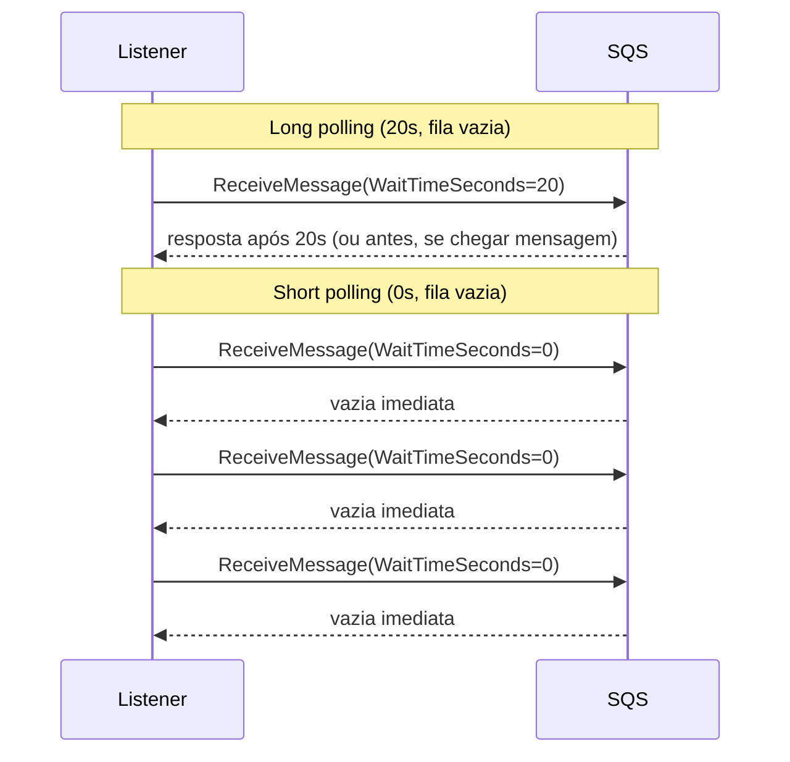
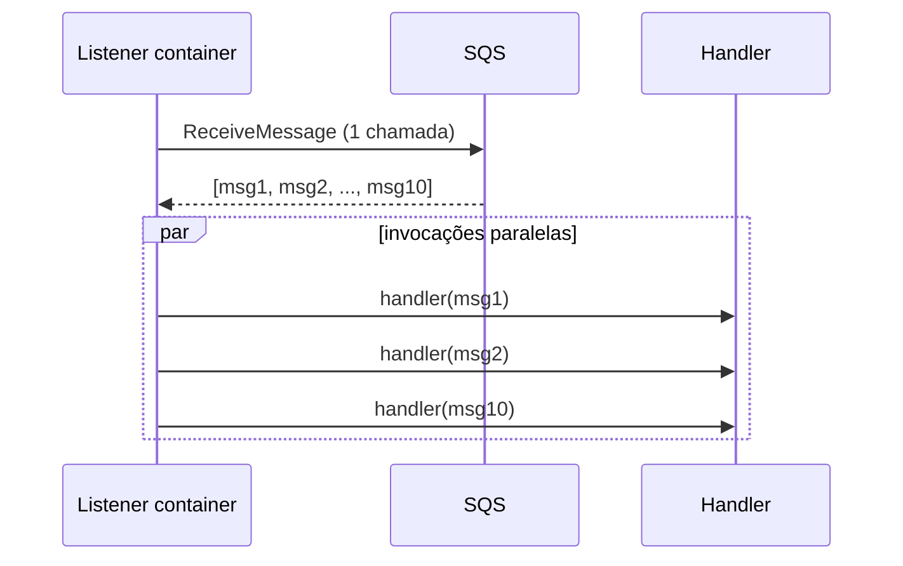
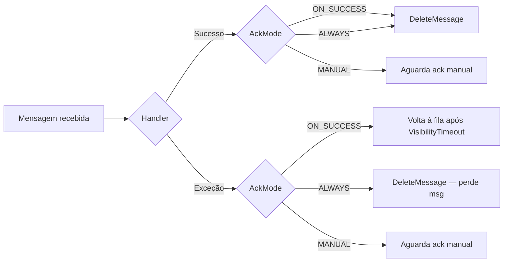
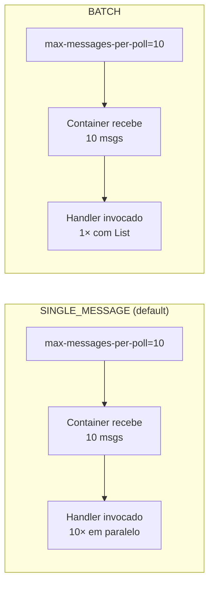

# Demo: Desacoplando com Mensageria no AWS SQS

## 1. Introdução

Esta demo valida o projeto completo em **AWS real**: dois microsserviços Spring Boot (ingestor e billing) conversando via SQS Standard, orquestrados pelo ECS Fargate atrás de um Application Load Balancer, com IAM granular por serviço, consumo em batch, polling configurável, correlation-id rastreável de ponta a ponta e Auto Scaling Step Scaling reagindo a CPU (ingestor) e queue-depth (billing).

**O que vamos fazer:**

- Provisionar a infraestrutura completa via CloudFormation (ECR, SQS, ECS Fargate + ALB).
- Inspecionar a fila no console AWS e pelo CLI.
- Verificar que o correlation-id viaja do HTTP até o log, passando pelo SQS como Message Attribute nativo.
- Derrubar o billing de propósito e confirmar que nenhuma mensagem se perde.
- Disparar carga com Grafana k6 e acompanhar o Step Scaling subir as tasks.
- Comparar short polling e long polling pela métrica `NumberOfEmptyReceives`.

**Ambiente:**

- **Região:** `us-east-1`
- **Cluster ECS:** `sqs-poc-cluster`
- **Services ECS:** `sqs-poc-ingestor`, `sqs-poc-billing`
- **Fila SQS:** `sqs-poc-billing-queue`
- **Log groups:** `/ecs/sqs-poc-ingestor`, `/ecs/sqs-poc-billing`

---

## 2. Provisionamento da Infraestrutura

O provisionamento usa **CloudFormation** em três stacks (ECR, SQS e ECS), conforme o padrão declarativo e reproduzível. Entre a stack de ECR e a de ECS fazemos o build e o push das imagens Docker para o repositório recém-criado.

### 2.1 Autenticar a AWS CLI

Antes de qualquer coisa, obtenha credenciais temporárias e confirme que está na região correta:

```bash
aws login
```

*Se for solicitada uma região, digite `us-east-1`.*

Verifique o acesso:

```bash
aws ec2 describe-regions --region-names us-east-1 --output table
```

Se a tabela com a região aparecer, o CLI está autenticado.

### 2.2 Criar Repositório ECR

O **Amazon ECR** (Elastic Container Registry) armazena as imagens Docker da aplicação. Precisa ser criado primeiro porque o ECS depende das imagens para iniciar as tasks.

📁 [`infra/1-ecr.yml`](infra/1-ecr.yml)

```bash
aws cloudformation create-stack \
  --stack-name sqs-poc-ecr \
  --template-body file://infra/1-ecr.yml

aws cloudformation wait stack-create-complete \
  --stack-name sqs-poc-ecr
```

Exportar os outputs da stack em variáveis locais:

```bash
OUTPUTS_ECR=$(aws cloudformation describe-stacks --stack-name sqs-poc-ecr \
  --query "Stacks[0].Outputs[*].[OutputKey,OutputValue]" --output text)

export ACCOUNT_ID=$(echo "$OUTPUTS_ECR" | awk '$1 == "AccountId" {print $2}')
export INGESTOR_REPO_URI=$(echo "$OUTPUTS_ECR" | awk '$1 == "IngestorRepositoryUri" {print $2}')
export BILLING_REPO_URI=$(echo "$OUTPUTS_ECR" | awk '$1 == "BillingRepositoryUri" {print $2}')

echo "Account: $ACCOUNT_ID"
echo "Ingestor repo: $INGESTOR_REPO_URI"
echo "Billing repo:  $BILLING_REPO_URI"
```

**Saída:**

```
Account: ****************
Ingestor repo: ****************.dkr.ecr.us-east-1.amazonaws.com/sqs-poc-ingestor
Billing repo:  ****************.dkr.ecr.us-east-1.amazonaws.com/sqs-poc-billing
```

### 2.3 Build e Push das Imagens Docker

Com os repositórios criados, fazemos o build dos dois microsserviços com o Maven Wrapper, empacotamos via Docker e publicamos no ECR. O login via `aws ecr get-login-password` gera um token temporário para o Docker autenticar.

```bash
aws ecr get-login-password --region us-east-1 | \
  docker login --username AWS --password-stdin ${ACCOUNT_ID}.dkr.ecr.us-east-1.amazonaws.com

# ms-payment-ingestor
(cd ms-payment-ingestor && ./mvnw clean package -DskipTests)
docker build -t ms-payment-ingestor ms-payment-ingestor
docker tag ms-payment-ingestor:latest ${INGESTOR_REPO_URI}:latest
docker push ${INGESTOR_REPO_URI}:latest

# ms-billing
(cd ms-billing && ./mvnw clean package -DskipTests)
docker build -t ms-billing ms-billing
docker tag ms-billing:latest ${BILLING_REPO_URI}:latest
docker push ${BILLING_REPO_URI}:latest
```

### 2.4 Criar a Fila SQS

A fila Standard é criada em uma stack separada, para ficar isolada do ciclo de vida do ECS. Isso permite manter a fila entre releases do backend.

📁 [`infra/2-sqs.yml`](infra/2-sqs.yml)

```bash
aws cloudformation create-stack \
  --stack-name sqs-poc-sqs \
  --template-body file://infra/2-sqs.yml

aws cloudformation wait stack-create-complete \
  --stack-name sqs-poc-sqs

OUTPUTS_SQS=$(aws cloudformation describe-stacks --stack-name sqs-poc-sqs \
  --query "Stacks[0].Outputs[*].[OutputKey,OutputValue]" --output text)

export QUEUE_NAME=$(echo "$OUTPUTS_SQS" | awk '$1 == "BillingQueueName" {print $2}')
export QUEUE_ARN=$(echo "$OUTPUTS_SQS"  | awk '$1 == "BillingQueueArn" {print $2}')
export QUEUE_URL=$(echo "$OUTPUTS_SQS"  | awk '$1 == "BillingQueueUrl" {print $2}')
```

### 2.5 Criar a Infraestrutura ECS

Esta stack cria o cluster ECS, VPC, subnets Multi-AZ, ALB, Security Groups, IAM Roles separadas por serviço (uma com permissão exclusiva de `SendMessage` e outra com `ReceiveMessage`/`DeleteMessage`), Task Definitions Fargate e as políticas de Step Scaling com alarmes. A flag `CAPABILITY_NAMED_IAM` é obrigatória porque criamos roles com nomes fixos para facilitar auditoria.

📁 [`infra/3-ecs.yml`](infra/3-ecs.yml) — principais recursos:

```yaml
# Multi-AZ: duas subnets públicas em us-east-1a e us-east-1b
PublicSubnetA:
PublicSubnetB:

# IAM granular por serviço
IngestorTaskRole:    # sqs:SendMessage + sqs:GetQueueUrl
BillingTaskRole:     # sqs:ReceiveMessage + sqs:DeleteMessage + sqs:GetQueueAttributes

# Auto Scaling
IngestorScalableTarget:      # Min 2, Max 6
BillingScalableTarget:       # Min 1, Max 5
IngestorStepScaleOutPolicy:  # CPU > 25% → +1 / +2 tasks
BillingStepScaleOutPolicy:   # ApproximateNumberOfMessagesVisible > 10 → +1 / +2 tasks
```

```bash
aws cloudformation create-stack \
  --stack-name sqs-poc-ecs \
  --template-body file://infra/3-ecs.yml \
  --capabilities CAPABILITY_NAMED_IAM \
  --parameters \
    ParameterKey=IngestorImageUri,ParameterValue=${INGESTOR_REPO_URI}:latest \
    ParameterKey=BillingImageUri,ParameterValue=${BILLING_REPO_URI}:latest \
    ParameterKey=BillingQueueName,ParameterValue=${QUEUE_NAME} \
    ParameterKey=BillingQueueArn,ParameterValue=${QUEUE_ARN} \
    ParameterKey=BillingQueueUrl,ParameterValue=${QUEUE_URL}

aws cloudformation wait stack-create-complete --stack-name sqs-poc-ecs

export ALB_URL=$(aws cloudformation describe-stacks --stack-name sqs-poc-ecs \
  --query "Stacks[0].Outputs[?OutputKey=='LoadBalancerUrl'].OutputValue" --output text)

echo "ALB URL: $ALB_URL"
```

**Saída:**

```
ALB URL: http://sqs-poc-alb-**********.us-east-1.elb.amazonaws.com
```

Este é o endpoint público do ingestor. O ALB distribui as requisições entre as tasks ECS e faz health checks automáticos em `/actuator/health`.

> 💡 O script [`scripts/deploy.sh`](scripts/deploy.sh) encadeia todos os comandos acima em uma única execução.

### 2.6 Verificar os Services Rodando

```bash
aws ecs describe-services \
  --cluster sqs-poc-cluster \
  --services sqs-poc-ingestor sqs-poc-billing \
  --query "services[*].{Name:serviceName,Desired:desiredCount,Running:runningCount,Pending:pendingCount}" \
  --output table
```

**Saída:**

```
+---------+-------------------+---------+---------+
| Desired |       Name        | Pending | Running |
+---------+-------------------+---------+---------+
|  2      |  sqs-poc-ingestor |  0      |  2      |
|  1      |  sqs-poc-billing  |  0      |  1      |
+---------+-------------------+---------+---------+
```

Teste o health check do ALB:

```bash
curl -s $ALB_URL/actuator/health
```

**Saída:**

```json
{"status":"UP"}
```

---

## 3. Overview do SQS no Console AWS

Abra **Console AWS > SQS > Filas > sqs-poc-billing-queue**. As métricas principais que queremos acompanhar:

- **Messages available** (`ApproximateNumberOfMessagesVisible`): prontas para serem consumidas.
- **Messages in flight** (`ApproximateNumberOfMessagesNotVisible`): entregues a um consumidor e dentro do Visibility Timeout (60s neste projeto).
- **Default visibility timeout:** 60s — bate com o que declaramos em `infra/2-sqs.yml`.
- **Receive message wait time:** 20s — long polling ativo por padrão na fila.

Um peek sem consumir a mensagem (clássico para debug):

```bash
aws sqs receive-message --queue-url $QUEUE_URL \
  --max-number-of-messages 1 \
  --visibility-timeout 0 \
  --message-attribute-names All
```

O `--visibility-timeout 0` devolve a mensagem para a fila imediatamente, então dá para inspecionar sem afetar o consumidor.

Atributos completos da fila via CLI:

```bash
aws sqs get-queue-attributes --queue-url $QUEUE_URL --attribute-names All \
  --query "Attributes.{VisibilityTimeout:VisibilityTimeout,LongPollingSeconds:ReceiveMessageWaitTimeSeconds,Available:ApproximateNumberOfMessages,InFlight:ApproximateNumberOfMessagesNotVisible}" \
  --output table
```

**Saída:**

```
+---------------------+------+
|  Available          |  0   |
|  InFlight           |  0   |
|  LongPollingSeconds |  20  |
|  VisibilityTimeout  |  60  |
+---------------------+------+
```

---

## 4. Headers SQS: Correlation-ID de Ponta a Ponta

O filter `CorrelationIdFilter` gera ou propaga o header `X-Correlation-ID` em toda requisição HTTP. O `PaymentQueueService` envia esse valor como SQS Message Attribute nativo, junto de `X-Source`. O listener do billing recebe os dois via `@Header` e os joga no MDC do logback, deixando cada linha de log rastreável.

Envie um pagamento com correlation-id explícito:

```bash
curl -X POST $ALB_URL/api/payments/webhook \
  -H "Content-Type: application/json" \
  -H "X-Correlation-ID: demo-headers-001" \
  -d '{"paymentId":"pay_headers_01","amount":299.90,"currency":"BRL","status":"succeeded","createdAt":"2026-04-20T10:00:00Z"}'
```

**Saída:**

```json
{"correlationId":"demo-headers-001","status":"accepted"}
```

Espie o Message Attribute diretamente na fila (antes do billing consumir). Se o billing estiver rápido demais, derrube-o temporariamente (seção 5.1):

```bash
aws sqs receive-message --queue-url $QUEUE_URL \
  --visibility-timeout 0 \
  --message-attribute-names All \
  --query "Messages[0].{Body:Body,Attributes:MessageAttributes}"
```

**Saída:**

```json
{
    "Body": "{\"paymentId\":\"pay_headers_01\",\"amount\":299.90,\"currency\":\"BRL\",\"status\":\"succeeded\",\"createdAt\":\"2026-04-20T10:00:00Z\"}",
    "Attributes": {
        "X-Correlation-ID": { "StringValue": "demo-headers-001",     "DataType": "String" },
        "X-Source":         { "StringValue": "ms-payment-ingestor",   "DataType": "String" },
        "contentType":      { "StringValue": "application/json",      "DataType": "String" }
    }
}
```

No **CloudWatch Logs Insights**, selecione o log group `/ecs/sqs-poc-billing` e rode:

```
fields @timestamp, @message
| filter @message like /demo-headers-001/
| sort @timestamp asc
| limit 50
```

**Saída esperada** (note o padrão `[cid=... src=...]` do `logback-spring.xml`):

```
23:42:41 INFO [sqsListenerEndpointContainer#0-1] [cid=demo-headers-001 src=ms-payment-ingestor] BillingQueueListener - Pagamento recebido da fila: pay_headers_01
23:42:50 INFO [sqsListenerEndpointContainer#0-1] [cid=demo-headers-001 src=ms-payment-ingestor] BillingProcessorService - Fatura persistida para pagamento pay_headers_01 — líquido: 57.98 USD
```

O mesmo correlation-id aparece do controller até a linha de persistência, cobrindo rastreabilidade ponta a ponta sem nenhuma tabela de correlação extra.

---

## 5. Resiliência: Parar o Billing e Não Perder Pagamentos

A principal promessa do desacoplamento é: se o consumidor cair, o produtor continua aceitando requisições e a fila segura tudo até o consumidor voltar. Vamos validar isso na prática.

### 5.1 Derruba o billing

```bash
aws ecs update-service \
  --cluster sqs-poc-cluster \
  --service sqs-poc-billing \
  --desired-count 0
```

Aguarde alguns segundos e confirme que `Running` está em 0:

```bash
aws ecs describe-services --cluster sqs-poc-cluster --services sqs-poc-billing \
  --query "services[0].{Desired:desiredCount,Running:runningCount}" --output table
```

**Saída:**

```
+---------+---------+
| Desired | Running |
+---------+---------+
|   0     |   0     |
+---------+---------+
```

### 5.2 Envia 3 pagamentos com o consumidor fora do ar

```bash
for i in 01 02 03; do
  curl -s -X POST $ALB_URL/api/payments/webhook \
    -H "Content-Type: application/json" \
    -H "X-Correlation-ID: demo-resilience-$i" \
    -d "{\"paymentId\":\"pay_res_$i\",\"amount\":$((100 + RANDOM % 500)).90,\"currency\":\"BRL\",\"status\":\"succeeded\",\"createdAt\":\"$(date -u +%Y-%m-%dT%H:%M:%SZ)\"}"
  echo ""
done
```

Cada um responde `202 Accepted` de imediato. Verifique que a fila acumulou as mensagens:

```bash
aws sqs get-queue-attributes --queue-url $QUEUE_URL \
  --attribute-names ApproximateNumberOfMessages ApproximateNumberOfMessagesNotVisible \
  --query "Attributes" --output table
```

**Saída:**

```
+-------------------------------+----------------------------------+
| ApproximateNumberOfMessages   | ApproximateNumberOfMessagesNotVisible |
+-------------------------------+----------------------------------+
|              3                |                0                 |
+-------------------------------+----------------------------------+
```

### 5.3 Restaura o billing e observa a drenagem

```bash
aws ecs update-service \
  --cluster sqs-poc-cluster \
  --service sqs-poc-billing \
  --desired-count 1
```

Acompanhe os logs em tempo real:

```bash
aws logs tail /ecs/sqs-poc-billing --since 10m --follow
```

Os três correlation-ids aparecem nos logs, processados em paralelo por threads `sqsListenerEndpointContainer#0-1`, `#0-2`, `#0-3`. Essa paralelização é o consumo em batch em ação: `maxMessagesPerPoll=10` puxa até dez mensagens por `ReceiveMessage` e o container as processa concorrentemente.

Nenhum pagamento se perdeu. O SQS segurou as três mensagens dentro do `MessageRetentionPeriod` (4 dias na nossa configuração) e o billing consumiu tudo quando voltou.

---

## 6. Teste de Carga com k6 e Auto Scaling

Dispare o script (stages `0 → 80 → 150 → 200 → 0` VUs em cerca de 3m30s):

```bash
./scripts/run_k6.sh
```

Em terminais paralelos, observe o Step Scaling reagir:

```bash
# Task count dos dois services
watch -n 5 'aws ecs describe-services --cluster sqs-poc-cluster \
  --services sqs-poc-ingestor sqs-poc-billing \
  --query "services[*].{Name:serviceName,Desired:desiredCount,Running:runningCount}" \
  --output table'

# Fila enchendo em tempo real
watch -n 5 'aws sqs get-queue-attributes --queue-url '"$QUEUE_URL"' \
  --attribute-names ApproximateNumberOfMessages --output text'

# Estado dos alarmes
aws cloudwatch describe-alarms \
  --alarm-names sqs-poc-ingestor-high-cpu sqs-poc-billing-high-queue \
  --query "MetricAlarms[].{Name:AlarmName,State:StateValue,Threshold:Threshold}" \
  --output table
```

**Saída capturada em uma execução:**

```
█ TOTAL RESULTS
  checks_total.......: 37440   178.24/s
  checks_succeeded...: 100.00% 37440 out of 37440
  http_req_failed....: 0.00%   0 out of 18720
  http_reqs..........: 18720   89.12/s
  http_req_duration..: p(95)=4.03s
```

E o scaling registrado em paralelo:

```
billing=3/3 ingestor=4/3 fila=0   alarms[billingH=ALARM ingestorH=ALARM]
billing=4/2 ingestor=4/3 fila=675 alarms[billingH=ALARM ingestorH=ALARM]
```

- O **ingestor** escalou de 2 para 4 tasks respondendo ao alarme `sqs-poc-ingestor-high-cpu` (CPU > 25% por 60s).
- O **billing** escalou de 1 para 4 tasks respondendo ao alarme `sqs-poc-billing-high-queue` (`ApproximateNumberOfMessagesVisible` > 10 por 60s).
- Zero pagamento perdido mesmo com p95 de 4s no pico.

Para listar as atividades de scaling registradas:

```bash
aws application-autoscaling describe-scaling-activities \
  --service-namespace ecs \
  --resource-id service/sqs-poc-cluster/sqs-poc-billing \
  --max-items 5 \
  --query "ScalingActivities[].{Time:StartTime,Desc:Description,Cause:Cause,Status:StatusCode}" \
  --output table
```

---

## 7. Tuning do Consumo SQS

Tudo que o consumidor faz é controlado por properties em [`ms-billing/src/main/resources/application.properties`](ms-billing/src/main/resources/application.properties), autoconfiguradas pelo `spring-cloud-aws-starter-sqs`. As três principais estão parametrizadas por env vars para permitir trocá-las via `aws ecs update-service` sem rebuild.

### 7.1 Propriedades e defaults

| Propriedade | Default | Controla |
|---|---|---|
| `spring.cloud.aws.sqs.listener.max-messages-per-poll` | `10` | Mensagens por `ReceiveMessage` |
| `spring.cloud.aws.sqs.listener.poll-timeout` | `10s` | `WaitTimeSeconds` (long vs short polling) |
| `spring.cloud.aws.sqs.listener.max-concurrent-messages` | `10` | Mensagens em voo simultâneas por fila |

Sem property global (ficam em `@SqsListener` ou bean customizado):

- `AcknowledgementMode` (default `ON_SUCCESS`)
- `ListenerMode` (default `SINGLE_MESSAGE`)

### 7.2 Long polling vs short polling

`poll-timeout` vira `WaitTimeSeconds` na chamada `ReceiveMessage`. Com long polling, o SQS segura a conexão aberta esperando mensagens surgirem, em vez de responder vazio na hora.



**Experimento:** registre uma nova task definition trocando `SQS_WAIT_TIME_SECONDS` de `20` para `0`:

```bash
aws ecs describe-task-definition --task-definition sqs-poc-billing \
  --query "taskDefinition" > /tmp/billing-td.json

# Edite /tmp/billing-td.json trocando SQS_WAIT_TIME_SECONDS de "20" para "0",
# ou use jq:
#   jq '(.containerDefinitions[0].environment[] | select(.name == "SQS_WAIT_TIME_SECONDS") | .value) = "0"' \
#     /tmp/billing-td.json > /tmp/billing-td-short.json

NEW_TD=$(MSYS_NO_PATHCONV=1 aws ecs register-task-definition \
  --cli-input-json file:///tmp/billing-td.json \
  --query "taskDefinition.taskDefinitionArn" --output text)

aws ecs update-service --cluster sqs-poc-cluster --service sqs-poc-billing \
  --task-definition "$NEW_TD" --force-new-deployment
```

Após o rolling terminar (cerca de 3 minutos), compare a métrica `NumberOfEmptyReceives`:

```bash
aws cloudwatch get-metric-statistics \
  --namespace AWS/SQS \
  --metric-name NumberOfEmptyReceives \
  --dimensions Name=QueueName,Value=sqs-poc-billing-queue \
  --statistics Sum \
  --start-time $(date -u -d '15 min ago' +%Y-%m-%dT%H:%M:%SZ) \
  --end-time   $(date -u +%Y-%m-%dT%H:%M:%SZ) \
  --period 60 \
  --query "Datapoints | sort_by(@, &Timestamp) | [*].{Time:Timestamp,EmptyReceives:Sum}" \
  --output table
```

**Saída capturada** (4-5 tasks do billing em cada modo, fila vazia):

```
+----------------+-----------------------------+
| EmptyReceives  |            Time             |
+----------------+-----------------------------+
|  3.0           |  20:54   <- long polling    |
|  0.0           |  20:56   <- long polling    |
|  2.0           |  20:59   <- long polling    |
|  0.0           |  21:02   <- long polling    |
|  2.0           |  21:03   <- rollout p/short |
|  11.0          |  21:06   <- short           |
|  1058.0        |  21:07   <- SHORT POLLING   |
+----------------+-----------------------------+
```

Long polling fica na faixa de 0-3 por minuto. Em short polling, salta para **1058/min** — cerca de 100× mais chamadas à API, sem benefício algum enquanto a fila está ociosa. Volte para long polling repetindo o procedimento com `SQS_WAIT_TIME_SECONDS=20`.

### 7.3 Consumo em batch (`max-messages-per-poll`)

Não muda o handler — ele continua recebendo uma mensagem por invocação. O que muda é quantas mensagens chegam ao container em uma única chamada `ReceiveMessage`.



Efeito prático: na seção 5, os 3 pagamentos foram processados em paralelo pelas threads `sqsListenerEndpointContainer#0-1`, `#0-2` e `#0-3` justamente porque uma única chamada `ReceiveMessage` trouxe os três.

### 7.4 Concorrência (`max-concurrent-messages`)

Teto de mensagens em voo por fila. A relação com `max-messages-per-poll` é direta:

- `max-concurrent-messages=100` + `max-messages-per-poll=10` → até 10 polls paralelas (100 ÷ 10), 100 em voo
- `max-concurrent-messages=10` + `max-messages-per-poll=10` → 1 poll por vez, 10 em voo

Dimensione pelo handler: I/O-bound (como o nosso, que chama Frankfurter) aceita valores maiores; CPU-bound deve ficar próximo ao número de vCPUs da task.

### 7.5 Acknowledgement modes

"Acknowledgement" é o `DeleteMessage` da API SQS. Sem ele, a mensagem volta à fila após o `VisibilityTimeout` e é reentregue.



- **`ON_SUCCESS`** (default, usado aqui): retry automático em caso de exceção. É o que queremos no billing, que é idempotente.
- **`ALWAYS`**: deleta mesmo em erro. Arrisca perda; só use se o handler já trata falha internamente.
- **`MANUAL`**: injete `Acknowledgement` no método e chame `acknowledge()` quando quiser. Útil quando o sucesso real depende de um passo posterior.

Override por listener:

```java
@SqsListener(value = "${app.queue.billing}", acknowledgementMode = "MANUAL")
public void onPaymentReceived(PaymentEventDTO event, Acknowledgement ack) {
    processorService.process(event);
    ack.acknowledge();
}
```

### 7.6 Listener mode: `SINGLE_MESSAGE` vs `BATCH`

Detectado pela assinatura do método.



O nosso handler é single-message e cada pagamento é independente — batch só faria sentido em cenário de bulk insert ou agregação atômica. Para ativar batch, basta mudar a assinatura:

```java
@SqsListener("${app.queue.billing}")
public void onPaymentsReceived(List<PaymentEventDTO> events) { ... }
```

---

## 8. Cleanup

O projeto mantém dois Services ECS rodando 24/7 enquanto estiver provisionado. Mesmo com Fargate elegível para free-tier, ALB e VPC continuam gerando custo. Sempre limpe o ambiente ao final.

Tudo de uma vez:

```bash
./scripts/cleanup.sh
```

Ou manualmente. As três stacks são independentes no CloudFormation, então as deletes podem rodar em paralelo. Só lembre de limpar as imagens do ECR antes, porque o CloudFormation se recusa a deletar um repositório que ainda tenha imagens dentro:

```bash
# 1. Limpa imagens do ECR (força delete)
aws ecr delete-repository --repository-name sqs-poc-ingestor --force
aws ecr delete-repository --repository-name sqs-poc-billing  --force

# 2. Dispara as 3 deletes em paralelo
aws cloudformation delete-stack --stack-name sqs-poc-ecs &
aws cloudformation delete-stack --stack-name sqs-poc-ecr &
aws cloudformation delete-stack --stack-name sqs-poc-sqs &
wait

# 3. Aguarda cada uma completar
aws cloudformation wait stack-delete-complete --stack-name sqs-poc-ecs
aws cloudformation wait stack-delete-complete --stack-name sqs-poc-ecr
aws cloudformation wait stack-delete-complete --stack-name sqs-poc-sqs

# 4. Log groups remanescentes
MSYS_NO_PATHCONV=1 aws logs delete-log-group --log-group-name /ecs/sqs-poc-ingestor 2>/dev/null || true
MSYS_NO_PATHCONV=1 aws logs delete-log-group --log-group-name /ecs/sqs-poc-billing  2>/dev/null || true
```

Confirme que nada sobrou:

```bash
aws cloudformation list-stacks --stack-status-filter CREATE_COMPLETE UPDATE_COMPLETE \
  --query "StackSummaries[?contains(StackName, 'sqs-poc')].StackName" --output text
```

A saída deve ser vazia. Ambiente zerado.
