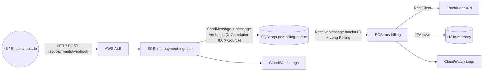

# Desacoplando com Mensageria no AWS SQS

Projeto prático construído a partir do artigo [**Desacoplando sistemas com mensageria no AWS SQS**](https://devsuperior.com.br/blog/desacoplando-sistemas-com-mensageria-no-aws-sqs) da DevSuperior, **Episódio 1 da série "Dominando Mensageria na AWS"**.

Enquanto o artigo sobe tudo localmente com LocalStack, aqui você provisionará a solução **em AWS real**: ECS Fargate, SQS Standard, ALB e Auto Scaling reagindo à carga em menos de um minuto.

> 📘 **Guia completo passo a passo:** [DEMO.md](DEMO.md)  
> 🔧 **Tuning do consumidor SQS (batch, polling, ack modes):** [TUNNING-SQS.md](TUNNING-SQS.md)

## Sumário

- [O que muda em relação ao artigo?](#o-que-muda-em-relação-ao-artigo)
- [Arquitetura](#arquitetura)
- [Pré-requisitos](#pré-requisitos)
- [Deploy completo](#-deploy-completo)
- [Smoke test](#-smoke-test)
- [Teste de carga](#-teste-de-carga)
- [Exemplos cURL](#-exemplos-curl)
- [Onde focar](#-onde-focar)
- [Cleanup](#-cleanup)

---

## O que muda em relação ao artigo?

- **Deploy na AWS:** Vamos utilizar o console AWS e o CLI para interagir com a nossa aplicação e a nossa fila.
- **Teste de carga:** Como a fila de comporta quando está sobre pressão.
- **Rastreabilidade ponta a ponta:** Correlation-ID no SQS Message Attribute entre o `ingestor` e o `billing`.
- **Tuning do consumo:** batch, polling e ack modes ajustáveis (detalhes em [TUNNING-SQS.md](TUNNING-SQS.md)).
- **Infra completa via CloudFormation:** ECR, SQS, ECS Fargate, ALB e CloudWatch.

## Arquitetura

Fluxo principal:



## Pré-requisitos

- **AWS CLI v2** autenticado, região padrão `us-east-1`.
- **Docker Desktop** rodando (para build/push da imagem ao ECR e para o k6 em container).
- **Java 25** + Maven Wrapper (já no repositório).
- **GitBash** no Windows (alguns comandos usam `MSYS_NO_PATHCONV=1` para evitar conversão de paths Unix como `/ecs/...`).

## 🚀 Deploy Completo

Um único comando orquestra ECR, build e push das imagens, SQS e ECS:

```bash
./scripts/deploy.sh
```

Tempo médio: 8 a 12 minutos (dependendo da rede e região). Trecho final da saída:

```
============================================================
Deploy concluido!
  ALB: http://sqs-poc-alb-1742980948.us-east-1.elb.amazonaws.com
  Queue URL: https://sqs.us-east-1.amazonaws.com/<ACCOUNT>/sqs-poc-billing-queue
  Cluster: sqs-poc-cluster
============================================================
```

Para rodar cada etapa manualmente e entender cada comando, siga o guia em [DEMO.md](DEMO.md).

## ✅ Smoke Test

```bash
./scripts/smoke-test.sh
```

Envia um pagamento com correlation-id único, aguarda a fila zerar e procura o mesmo id nos logs do billing. Saída esperada:

```
==> Health check em http://sqs-poc-alb-*.us-east-1.elb.amazonaws.com/actuator/health
    OK
==> Enviando pagamento de teste (correlationId=smoke-1776728546)
{"correlationId":"smoke-1776728546","status":"accepted"}
==> Aguardando fila zerar (timeout 60s)
    tentativa 1: mensagens na fila = 0
==> Smoke-test concluido.
```

## 📊 Teste de Carga

```bash
./scripts/run_k6.sh
```

Dispara o k6 em container com stages `0 → 80 → 150 → 200 → 0` VUs em cerca de 3m30s. Trecho final da saída:

```
█ TOTAL RESULTS
  checks_succeeded...: 100.00% 37440 out of 37440
  http_req_failed....: 0.00%   0 out of 18720
  http_reqs..........: 18720   89.12/s
  http_req_duration..: p(95)=4.03s
```

Para acompanhar o Auto Scaling do ingestor em paralelo:

```bash
aws ecs describe-services --cluster sqs-poc-cluster --services sqs-poc-ingestor \
  --query "services[0].{Desired:desiredCount,Running:runningCount}"

aws sqs get-queue-attributes --queue-url <URL_DA_FILA> \
  --attribute-names ApproximateNumberOfMessages
```

## 🔍 Exemplos cURL

Webhook com correlation-id explícito (útil para rastrear uma transação específica nos logs):

```bash
curl -X POST $ALB_URL/api/payments/webhook \
  -H "Content-Type: application/json" \
  -H "X-Correlation-ID: demo-headers-001" \
  -d '{"paymentId":"pay_001","amount":299.90,"currency":"BRL","status":"succeeded","createdAt":"2026-04-20T10:00:00Z"}'
```

Sem o header, o filter gera um UUID automaticamente e o devolve no response:

```bash
curl -X POST $ALB_URL/api/payments/webhook \
  -H "Content-Type: application/json" \
  -d '{"paymentId":"pay_002","amount":500.00,"currency":"USD","status":"succeeded","createdAt":"2026-04-20T10:00:00Z"}'
```

## 📁 Onde Focar

Arquivos-chave caso você queira mergulhar no código:

- [`infra/3-ecs.yml`](infra/3-ecs.yml): VPC, ALB, 2 Services Fargate, IAM Roles separadas, Step Scaling com alarmes.
- [`ms-payment-ingestor/.../filter/CorrelationIdFilter.java`](ms-payment-ingestor/src/main/java/com/devsuperior/ingestor/filter/CorrelationIdFilter.java): geração e propagação do correlation-id.
- [`ms-payment-ingestor/.../service/PaymentQueueService.java`](ms-payment-ingestor/src/main/java/com/devsuperior/ingestor/service/PaymentQueueService.java): envio ao SQS com Message Attributes.
- [`ms-billing/src/main/resources/application.properties`](ms-billing/src/main/resources/application.properties): tuning do listener SQS via auto-config.
- [`ms-billing/.../listener/BillingQueueListener.java`](ms-billing/src/main/java/com/devsuperior/billing/listener/BillingQueueListener.java): `@Header` lendo Message Attributes e populando o MDC.
- [`scripts/deploy.sh`](scripts/deploy.sh): orquestração completa do provisionamento.

## 🧹 Cleanup

```bash
./scripts/cleanup.sh
```

Destrói tudo em paralelo: ECS, ECR (com force delete das imagens) e SQS, além dos log groups remanescentes. Saída esperada:

```
==> Disparando deletes em paralelo (ECS + ECR + SQS sao independentes)
==> Limpando repositorio ECR sqs-poc-ingestor (force)
==> Limpando repositorio ECR sqs-poc-billing (force)
==> Aguardando sqs-poc-ecs finalizar delete...
    sqs-poc-ecs removida
    sqs-poc-ecr removida
    sqs-poc-sqs removida
==> Cleanup concluido.
```

**Execute ao fim de cada uso para evitar cobranças.**
