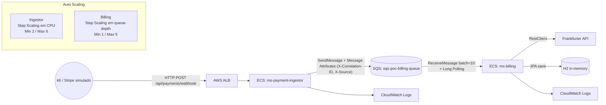

# Desacoplando com Mensageria no AWS SQS

Projeto prático construído a partir do artigo [**Desacoplando sistemas com mensageria no AWS SQS**](https://devsuperior.com.br/blog/desacoplando-sistemas-com-mensageria-no-aws-sqs) da DevSuperior, **Episódio 1 da série "Dominando Mensageria na AWS"**.

Enquanto o artigo sobe tudo localmente com LocalStack, aqui a solução vai para a **AWS real**. Provisionamos ECS Fargate, SQS Standard e ALB via CloudFormation; aplicamos IAM granular; ligamos consumo em batch com polling configurável; propagamos um correlation-id de ponta a ponta como SQS Message Attribute; e submetemos o sistema a teste de estresse com Grafana k6, observando o Step Scaling reagir em menos de um minuto à carga.

## O que muda em relação ao artigo?

- **Infra real na AWS via CloudFormation** em 3 stacks (`1-ecr.yml`, `2-sqs.yml`, `3-ecs.yml`). Provisiona VPC, ALB, ECS Cluster, 2 Services Fargate, SQS Standard e CloudWatch Logs.
- **IAM granular**: `ms-payment-ingestor` só pode `sqs:SendMessage`; `ms-billing` só pode `sqs:ReceiveMessage`, `sqs:DeleteMessage`, `sqs:GetQueueAttributes`.
- **Consumo em batch via Spring Cloud AWS**: listener factory customizado (`SqsListenerConfig`) com `maxMessagesPerPoll=10` e `pollTimeout` configurável.
- **Polling configurável em runtime** pelas variáveis de ambiente `SQS_WAIT_TIME_SECONDS` (long vs short) e `SQS_MAX_MESSAGES_PER_POLL`, trocáveis sem rebuild.
- **Correlation-ID como SQS Message Attribute**: um `OncePerRequestFilter` gera/propaga o header `X-Correlation-ID` e o `PaymentQueueService` o injeta em `.header()` do `SqsTemplate`. O billing lê via `@Header` e joga no MDC.
- **Teste de estresse com Grafana k6** rodando em container, com stages agressivos (200 VUs no pico) contra o ALB do ingestor.
- **Auto Scaling dual com Step Scaling**: ingestor escala por CPU (AWS/ECS `CPUUtilization`), billing escala por queue-depth (AWS/SQS `ApproximateNumberOfMessagesVisible`). Cada um com alarme e degraus explícitos.
- **Logs estruturados** com `logback-spring.xml` injetando `[cid=<correlation-id> src=<origem>]` em todas as linhas do billing, prontos para consulta no CloudWatch Logs Insights.

## Arquitetura



## Pré-requisitos

- **AWS CLI v2** autenticado na conta destino.
- **Docker Desktop** em execução.
- **Java 25** (os Dockerfiles usam `amazoncorretto:25-alpine`, o Maven Wrapper já está no repositório).
- **GitBash** no Windows (todos os scripts são Bash).
- Região padrão: `us-east-1`.

## Deploy completo

Um único comando orquestra ECR, build e push das imagens, SQS e ECS:

```bash
./scripts/deploy.sh
```

Ao final, o script imprime a URL do ALB, a URL da fila e o nome do cluster. Tempo médio: cerca de 8 minutos.

Para rodar cada etapa manualmente com o detalhe de cada comando, siga o guia em [DEMO.md](DEMO.md).

## Smoke test

```bash
./scripts/smoke-test.sh
```

Envia um pagamento com correlation-id único, aguarda a fila zerar e busca o mesmo id nos logs do billing. Saída verde confirma que o fluxo ingestor → SQS → billing está saudável.

## Teste de carga

```bash
./scripts/run_k6.sh
```

Dispara o k6 em container com stages `0 → 80 → 150 → 200 → 0` VUs em cerca de 3m30s. Para observar o Auto Scaling em paralelo:

```bash
aws ecs describe-services --cluster sqs-poc-cluster --services sqs-poc-billing \
  --query "services[0].{Desired:desiredCount,Running:runningCount}"

aws sqs get-queue-attributes --queue-url <URL_DA_FILA> \
  --attribute-names ApproximateNumberOfMessages
```

## Exemplos cURL

Webhook com correlation-id explícito (útil para rastrear uma transação específica nos logs):

```bash
curl -X POST $ALB_URL/api/payments/webhook \
  -H "Content-Type: application/json" \
  -H "X-Correlation-ID: demo-headers-001" \
  -d '{"paymentId":"pay_001","amount":299.90,"currency":"BRL","status":"succeeded","createdAt":"2026-04-20T10:00:00Z"}'
```

Sem o header, o filter gera um UUID automaticamente e o devolve no response:

```bash
curl -X POST $ALB_URL/api/payments/webhook \
  -H "Content-Type: application/json" \
  -d '{"paymentId":"pay_002","amount":500.00,"currency":"USD","status":"succeeded","createdAt":"2026-04-20T10:00:00Z"}'
```

## Onde focar

Arquivos-chave caso você queira mergulhar no código:

- [`infra/3-ecs.yml`](infra/3-ecs.yml): VPC, ALB, 2 Services Fargate, IAM Roles separadas, Step Scaling com alarmes.
- [`ms-payment-ingestor/.../filter/CorrelationIdFilter.java`](ms-payment-ingestor/src/main/java/com/devsuperior/ingestor/filter/CorrelationIdFilter.java): geração e propagação do correlation-id.
- [`ms-payment-ingestor/.../service/PaymentQueueService.java`](ms-payment-ingestor/src/main/java/com/devsuperior/ingestor/service/PaymentQueueService.java): envio para o SQS com Message Attributes.
- [`ms-billing/.../config/SqsListenerConfig.java`](ms-billing/src/main/java/com/devsuperior/billing/config/SqsListenerConfig.java): factory de listener com batch e polling configuráveis.
- [`ms-billing/.../listener/BillingQueueListener.java`](ms-billing/src/main/java/com/devsuperior/billing/listener/BillingQueueListener.java): `@Header` lendo Message Attributes e populando o MDC.
- [`scripts/deploy.sh`](scripts/deploy.sh): orquestração completa do provisionamento.

## Cleanup

```bash
./scripts/cleanup.sh
```

Destrói tudo em paralelo: ECS, ECR (com force delete das imagens) e SQS, além dos log groups remanescentes. **Execute ao fim de cada uso para evitar cobranças.**

## Guia completo

O passo a passo com todos os comandos, saídas esperadas e explicações (provisionamento, overview do SQS, inspeção de headers, resiliência com billing parado, teste de carga, short vs long polling e cleanup) está em [DEMO.md](DEMO.md).
