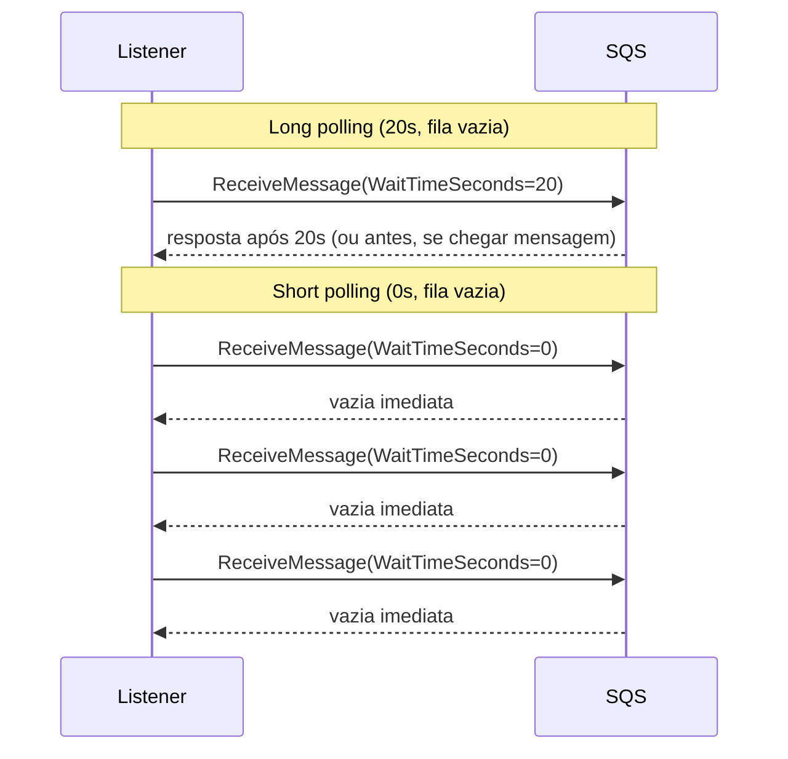
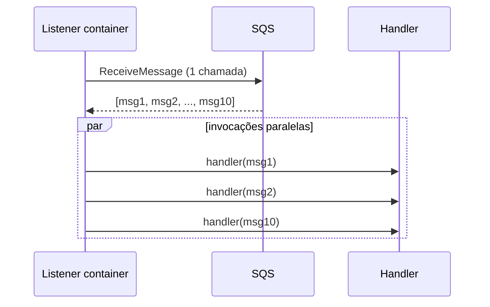
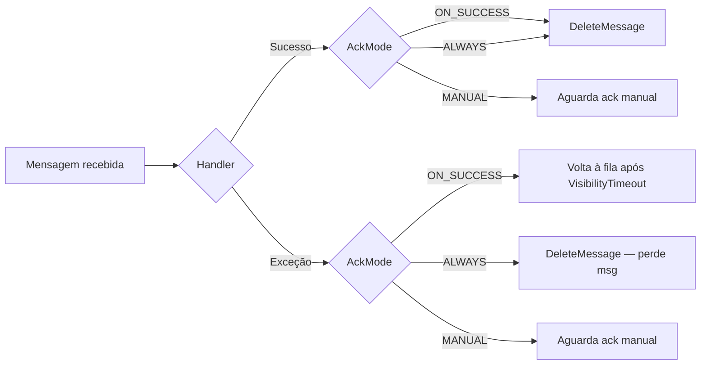
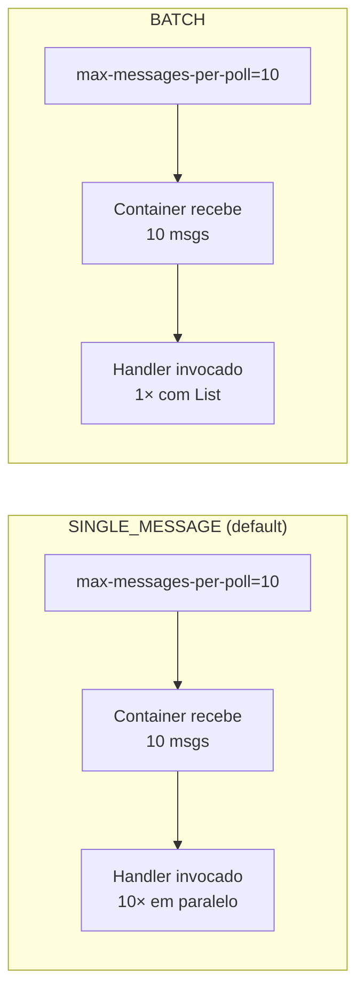

# Tuning do Consumo SQS

Guia dedicado ao comportamento do consumidor SQS neste projeto: quais propriedades o Spring Cloud AWS expõe, como elas afetam a interação com a API do SQS e quando cada opção faz sentido. Use como referência ao ajustar o `ms-billing` ou ao portar a solução para outros casos de uso.

## Sumário

- [Propriedades e defaults](#propriedades-e-defaults)
- [Long polling vs short polling](#long-polling-vs-short-polling)
- [Consumo em batch (`max-messages-per-poll`)](#consumo-em-batch-max-messages-per-poll)
- [Concorrência (`max-concurrent-messages`)](#concorrência-max-concurrent-messages)
- [Acknowledgement modes](#acknowledgement-modes)
- [Listener mode: `SINGLE_MESSAGE` vs `BATCH`](#listener-mode-single_message-vs-batch)

---

## Propriedades e defaults

Tudo que o consumidor faz é controlado por properties em [`ms-billing/src/main/resources/application.properties`](ms-billing/src/main/resources/application.properties), autoconfiguradas pelo `spring-cloud-aws-starter-sqs`. As três principais estão parametrizadas por env vars para permitir trocá-las via `aws ecs update-service` sem rebuild.

| Propriedade | Default | Controla |
|---|---|---|
| `spring.cloud.aws.sqs.listener.max-messages-per-poll` | `10` | Mensagens por `ReceiveMessage` |
| `spring.cloud.aws.sqs.listener.poll-timeout` | `10s` | `WaitTimeSeconds` (long vs short polling) |
| `spring.cloud.aws.sqs.listener.max-concurrent-messages` | `10` | Mensagens em voo simultâneas por fila |

Sem property global (ficam em `@SqsListener` ou bean customizado):

- `AcknowledgementMode` (default `ON_SUCCESS`)
- `ListenerMode` (default `SINGLE_MESSAGE`)

---

## Long polling vs short polling

`poll-timeout` vira `WaitTimeSeconds` na chamada `ReceiveMessage`. Com long polling, o SQS segura a conexão aberta esperando mensagens surgirem, em vez de responder vazio na hora.



### Experimento: alternar em runtime

Registre uma nova task definition trocando `SQS_WAIT_TIME_SECONDS` de `20` para `0`:

```bash
aws ecs describe-task-definition --task-definition sqs-poc-billing \
  --query "taskDefinition" > /tmp/billing-td.json

# Edite /tmp/billing-td.json trocando SQS_WAIT_TIME_SECONDS de "20" para "0",
# ou use jq:
#   jq '(.containerDefinitions[0].environment[] | select(.name == "SQS_WAIT_TIME_SECONDS") | .value) = "0"' \
#     /tmp/billing-td.json > /tmp/billing-td-short.json

NEW_TD=$(MSYS_NO_PATHCONV=1 aws ecs register-task-definition \
  --cli-input-json file:///tmp/billing-td.json \
  --query "taskDefinition.taskDefinitionArn" --output text)

aws ecs update-service --cluster sqs-poc-cluster --service sqs-poc-billing \
  --task-definition "$NEW_TD" --force-new-deployment
```

Após o rolling terminar (cerca de 3 minutos), compare a métrica `NumberOfEmptyReceives`:

```bash
aws cloudwatch get-metric-statistics \
  --namespace AWS/SQS \
  --metric-name NumberOfEmptyReceives \
  --dimensions Name=QueueName,Value=sqs-poc-billing-queue \
  --statistics Sum \
  --start-time $(date -u -d '15 min ago' +%Y-%m-%dT%H:%M:%SZ) \
  --end-time   $(date -u +%Y-%m-%dT%H:%M:%SZ) \
  --period 60 \
  --query "Datapoints | sort_by(@, &Timestamp) | [*].{Time:Timestamp,EmptyReceives:Sum}" \
  --output table
```

**Saída capturada** (4-5 tasks do billing em cada modo, fila vazia):

```
+----------------+-----------------------------+
| EmptyReceives  |            Time             |
+----------------+-----------------------------+
|  3.0           |  20:54   <- long polling    |
|  0.0           |  20:56   <- long polling    |
|  2.0           |  20:59   <- long polling    |
|  0.0           |  21:02   <- long polling    |
|  2.0           |  21:03   <- rollout p/short |
|  11.0          |  21:06   <- short           |
|  1058.0        |  21:07   <- SHORT POLLING   |
+----------------+-----------------------------+
```

Long polling fica na faixa de 0-3 por minuto. Em short polling, salta para **1058/min** — cerca de 100× mais chamadas à API, sem benefício algum enquanto a fila está ociosa. Volte para long polling repetindo o procedimento com `SQS_WAIT_TIME_SECONDS=20`.

---

## Consumo em batch (`max-messages-per-poll`)

Não muda o handler — ele continua recebendo uma mensagem por invocação. O que muda é quantas mensagens chegam ao container em uma única chamada `ReceiveMessage`.



Efeito prático: na seção de resiliência do [DEMO.md](DEMO.md), os 3 pagamentos foram processados em paralelo pelas threads `sqsListenerEndpointContainer#0-1`, `#0-2` e `#0-3` justamente porque uma única chamada `ReceiveMessage` trouxe os três.

---

## Concorrência (`max-concurrent-messages`)

Teto de mensagens em voo por fila. A relação com `max-messages-per-poll` é direta:

- `max-concurrent-messages=100` + `max-messages-per-poll=10` → até 10 polls paralelas (100 ÷ 10), 100 em voo
- `max-concurrent-messages=10` + `max-messages-per-poll=10` → 1 poll por vez, 10 em voo

Dimensione pelo handler: I/O-bound (como o nosso, que chama Frankfurter) aceita valores maiores; CPU-bound deve ficar próximo ao número de vCPUs da task.

---

## Acknowledgement modes

"Acknowledgement" é o `DeleteMessage` da API SQS. Sem ele, a mensagem volta à fila após o `VisibilityTimeout` e é reentregue.



- **`ON_SUCCESS`** (default, usado aqui): retry automático em caso de exceção. É o que queremos no billing, que é idempotente.
- **`ALWAYS`**: deleta mesmo em erro. Arrisca perda; só use se o handler já trata falha internamente.
- **`MANUAL`**: injete `Acknowledgement` no método e chame `acknowledge()` quando quiser. Útil quando o sucesso real depende de um passo posterior.

Override por listener:

```java
@SqsListener(value = "${app.queue.billing}", acknowledgementMode = "MANUAL")
public void onPaymentReceived(PaymentEventDTO event, Acknowledgement ack) {
    processorService.process(event);
    ack.acknowledge();
}
```

---

## Listener mode: `SINGLE_MESSAGE` vs `BATCH`

Detectado pela assinatura do método.



O nosso handler é single-message e cada pagamento é independente — batch só faria sentido em cenário de bulk insert ou agregação atômica. Para ativar batch, basta mudar a assinatura:

```java
@SqsListener("${app.queue.billing}")
public void onPaymentsReceived(List<PaymentEventDTO> events) { ... }
```
